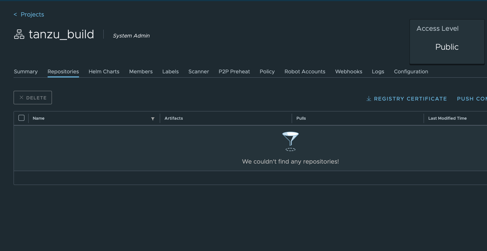

# Install Tanzu Build Service using a local Harbor Registry with a self signed cert
 
 
 In Harbor create a project named build-service 🔧


 ## 

 With Docker login to registry.pivotal.io 🔧

 ```
 docker login registry.pivotal.io
 
 docker login core.harbor.domain
 ```

 ##
 
 Attempt to use imgpkg to copy the containers to your local Harbor with a self signed cert 🔧

 ```
  imgpkg copy -b "registry.pivotal.io/build-service/bundle:1.2.2" --to-repo core.harbor.domain/build-service/build-service
 ```
 
 Notice the error you received

 ```
 Error: Retried 5 times: Get "https://core.harbor.domain/v2/": x509: certificate signed by unknown authority
 ```


## Download your Registry Certificate from the Harbor UI 🔧

 

##

copy the cert to /tmp/ca.crt 🔧

```
cp Desktop/ca-5.crt /tmp/ca.crt
```

Find your kind CONTAINER ID 🔧
 
```
docker ps
```

Add the cert to the shared folder of your Kind container 🔧
 
```
docker cp /tmp/ca.crt <CONTAINER ID>:/usr/local/share/ca-certificates

docker exec -t <CONTAINER ID> update-ca-certificates 

docker exec -t <CONTAINER ID> systemctl restart containerd.service
```
```
sudo cp /tmp/ca.crt /etc/docker/certs.d/core.harbor.domain/ca.crt
```


##

 Attempt to use imgpkg to copy the containers to your local Harbor with a self signed cert using this flag --registry-ca-cert-path 🔧
 
 ```
 imgpkg copy -b "registry.pivotal.io/build-service/bundle:1.2.2" --to-repo core.harbor.domain/build-service/build-service --registry-ca-cert-path=/tmp/ca.crt 
 ```
 
 
 
  ##   
 
 Pull the Tanzu Build Service bundle image locally using imgpkg 🔧
 
 
 ```
 imgpkg pull -b "core.harbor.domain/build-service/build-service:1.2.2" -o /tmp/bundle --registry-ca-cert-path=/tmp/ca.crt 
 ```
 
## Install Tanzu Build Service by running the command below 🔧
 
 ```
 ytt -f /tmp/bundle/values.yaml \
    -f /tmp/bundle/config/ \
    -f /tmp/ca.crt \
    -v docker_repository='core.harbor.domain/build-service/build-service' \
    -v docker_username='admin' \
    -v docker_password='Harbor12345' \
    | kbld -f /tmp/bundle/.imgpkg/images.yml -f- \
    | kapp deploy -a tanzu-build-service -f- -y   
 ```

 
 ## Verify the install 🔧
 
 Ensure that the kpack controller & webhook have a status of Running using kubectl get.
 
 ```
 kubectl get pods -n kpack
 ```
 
 Ensure that the dependency updater was created in the build-service namespace.

 ```
 kubectl get pods -n build-service
 ``` 
 

  


 
 ## Create a secret with container repo creds 🔧

Set registry creds
https://github.com/vmware-tanzu/kpack-cli/blob/main/docs/kp_secret_create.md

```
kp secret create my-registry-cred --registry core.harbor.domain --registry-user admin
```
  
  ### Harbor
 🔍 "my-registry-creds" and "--registry-user" to create credentials for other registries. Use the "REGISTRY_PASSWORD" env var to bypass the password prompt.
 

 
## Dependency Descriptor file 🔧
Download the Dependency Descriptor file (descriptor-<version>.yaml) from the latest release on the Tanzu Build Service Dependencies page on Tanzu Network. This file contains paths to images that contain dependency resources Tanzu Build Service needs to execute image builds.
 
```
 mkdir build
 cd build
```
 
 ```
 pivnet download-product-files --product-slug='tbs-dependencies' --release-version='100.0.170' --product-file-id=1044254
 ```
 
 Import descriptor file 🚨🚨🚨 - currently not working (connect: connection refused)
 
 ```
 kp import -f descriptor-100.0.170.yaml --registry-ca-cert-path /tmp/ca.crt
 ```
 
  List the cluster builders available in your installation:
 
 ```
 kp clusterbuilder list
 ```
 
 
## Create an image 🔧
 
``` 
kp image create dotnet-demo --tag cmccarth/dotnet-demo --git https://github.com/corn-pivotal/TBS-Demo-App.git --git-revision main --registry-ca-cert-path=/tmp/ca.crt 
``` 
 
 
View default namespace - to see pods spinning up 
 
 ```
 kubectl get pods
 ```
 
 ```
 kp image list
 ```


 
 
 notes:
 
 ```
 kbld package -f descriptor-<version>.yaml \
  --output /tmp/packaged-dependencies.tar
 ```
 
 ```
 kbld unpackage -f descriptor-100.0.170.yaml \
  --input /tmp/packaged-dependencies.tar \
  --repository 'core.harbor.domain/build-service/build-service' \
  --lock-output /tmp/dependencies-relocated.lock \
  --registry-ca-cert-path /tmp/ca.crt
 ```
 
 ```
 kbld -f descriptor-100.0.170.yaml -f /tmp/dependencies-relocated.lock | kp import -f - --registry-ca-cert-path /tmp/ca.crt
 ```
 

## References

https://github.com/vmware-tanzu/carvel-kapp-controller/issues/39

https://vmtechie.blog/2021/09/11/code-to-container-with-tanzu-build-service/

https://community.pivotal.io/s/article/kapp-controller-reconcile-fails-when-private-registry-uses-self-signed-certs?language=en_US
 
https://github.com/kubernetes-sigs/kind/issues/110 <-- Kind insecure registries
                                                       
https://makk.es/blog/docker-registry-on-k8s/#the-complete-rundown-
                                                       
```                                                       
                                                     
